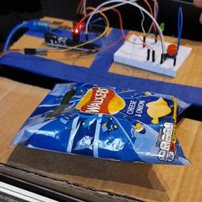
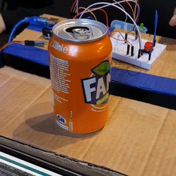
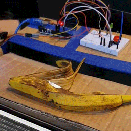

# Smart Waste
Waste collection and management using IoT and Computer Vision.

## Demo

Connect machine to Arduino and run `python/predict.py`.

### Recycling with computer vision

Recyclable wastes will be dropped inside the bin.

Non-recyclable wastes will be dropped outside the bin.

### Bin capacity detection

If the bin is full, green LED will light up.

## Key Functions

- Classifies incoming waste into categories (Recyclable/Organic)
- Detects whether the bin is full

## How this was built 

For the hardware setup, we began by constructing a bin with a cardboard box. We mounted the Arduino board on the box and the arduino serves as a control system. We integrated a servo motor, a LED, an ultrasonic sensor and a camera. 
On the software side, the Arduino code manages all the components,while a keras model is used to identify whether an object is recyclable or organic. 
 
## Challenges we encountered 

1. Poor Quality of Camera
2. Limited dataset size
3. Model incorrectly classifying similar colored objects

